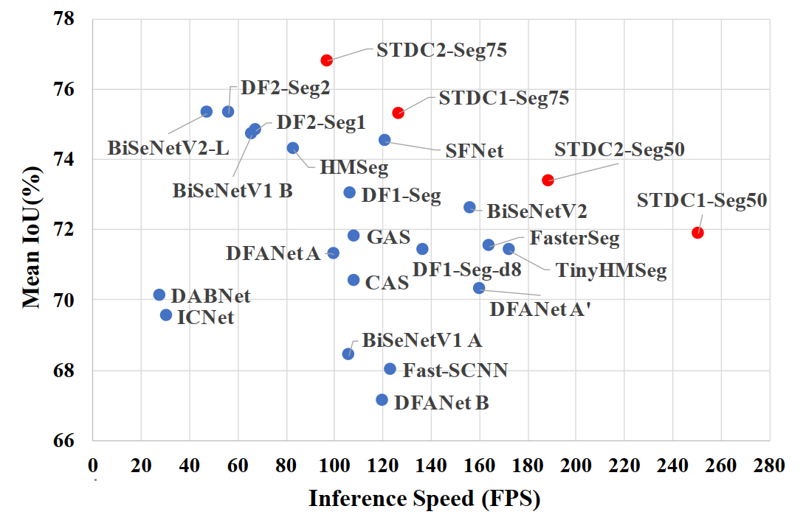
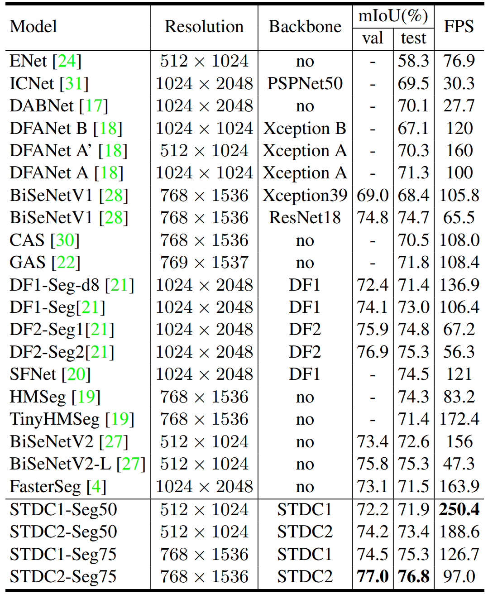
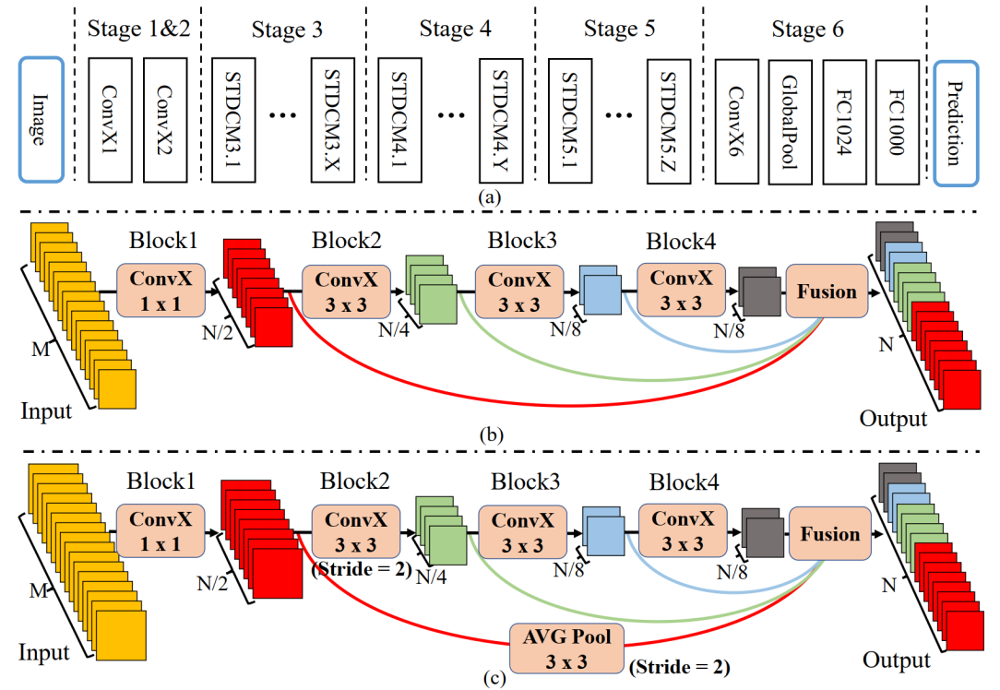
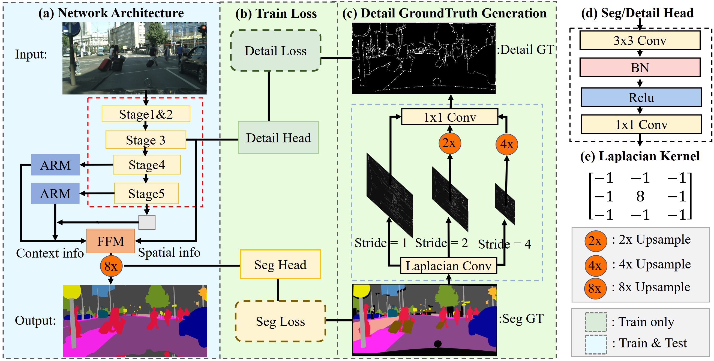

# Rethinking BiSeNet For Real-time Semantic Segmentation[[PDF](https://openaccess.thecvf.com/content/CVPR2021/papers/Fan_Rethinking_BiSeNet_for_Real-Time_Semantic_Segmentation_CVPR_2021_paper.pdf)]

[](https://opensource.org/licenses/MIT)

Mingyuan Fan, Shenqi Lai, Junshi Huang, Xiaoming Wei, Zhenhua Chai, Junfeng Luo, Xiaolin Wei

In CVPR 2021.

## Overview

<p align="center">
  </br>
  <span align="center">Speed-Accuracy performance comparison on the Cityscapes test set</span> 
</p>
We present STDC-Seg, an mannully designed semantic segmentation network with not only state-of-the-art performance but also faster speed than current methods.

Highlights:

* **Short-Term Dense Concatenation Net**: A task-specific network for dense prediction task.
* **Detail Guidance**: encode spatial information without harming inference speed.
* **SOTA**: STDC-Seg achieves extremely fast speed (over 45\% faster than the closest automatically designed competitor on CityScapes)  and maintains competitive accuracy.
  - see our Cityscapes test set submission [STDC1-Seg50](https://www.cityscapes-dataset.com/anonymous-results/?id=805e22f63fc53d1d0726cefdfe12527275afeb58d7249393bec6f483c3342b3b)  [STDC1-Seg75](https://www.cityscapes-dataset.com/anonymous-results/?id=6bd0def75600fd0f1f411101fe2bbb0a2be5dba5c74e2f7d7f50eecc23bae64c)  [STDC2-Seg50](https://www.cityscapes-dataset.com/anonymous-results/?id=b009a595f0d4e10a7f10ac25f29962b67995dc11b059f0c733ddd212a56b9ee0)  [STDC2-Seg75](https://www.cityscapes-dataset.com/anonymous-results/?id=9012a16cdeb9d52aaa9ad5fb9cc1c6284efe8a3daecee85b4413284364ff3f45).
  - Here is our speed-accuracy comparison on Cityscapes test&val set.

<p align="center">
</br>
</p>

## Methods

<p align="center">
</br>
</p>

<p align="center">
</br>
  <span align="center">Overview of the STDC Segmentation network</span> 
</p>

## Prerequisites

- Pytorch 1.1
- Python 3.5.6
- NVIDIA GPU
- TensorRT v5.1.5.0 (Only need for testing inference speed)

This repository has been trained on Tesla V100. Configurations (e.g batch size, image patch size) may need to be changed on different platforms. Also, for fair competition, we test the inference speed on NVIDIA GTX 1080Ti.

## Installation

* Clone this repo:

```bash
git clone https://github.com/MichaelFan01/STDC-Seg.git
cd STDC-Seg
```

* Install dependencies:

```bash
pip install -r requirements.txt
```

* Install [PyCuda](https://wiki.tiker.net/PyCuda/Installation) which is a dependency of TensorRT.
* Install [TensorRT](https://github.com/NVIDIA/TensorRT) (v5.1.5.0): a library for high performance inference on NVIDIA GPUs with [Python API](https://docs.nvidia.com/deeplearning/sdk/tensorrt-api/index.html#python).

## Usage

### 0. Prepare the dataset

* Download the [leftImg8bit_trainvaltest.zip](https://www.cityscapes-dataset.com/file-handling/?packageID=3) and [gtFine_trainvaltest.zip](https://www.cityscapes-dataset.com/file-handling/?packageID=1) from the Cityscapes.
* Link data to the  `data` dir.

  ```bash
  ln -s /path_to_data/cityscapes/gtFine data/gtFine
  ln -s /path_to_data/leftImg8bit data/leftImg8bit
  ```

### 1. Train STDC-Seg

Note: Backbone STDCNet813 denotes STDC1, STDCNet1446 denotes STDC2.

* Train STDC1Seg:

```bash
export CUDA_VISIBLE_DEVICES=0,1,2
python -m torch.distributed.launch \
--nproc_per_node=3 train.py \
--respath checkpoints/train_STDC1-Seg/ \
--backbone STDCNet813 \
--mode train \
--n_workers_train 12 \
--n_workers_val 1 \
--max_iter 60000 \
--use_boundary_8 True \
--pretrain_path checkpoints/STDCNet813M_73.91.tar \
--plane_aux_loss_type ce_hard \
--plane_loss_weight 0.4
```

* Train STDC2Seg:

```bash
export CUDA_VISIBLE_DEVICES=0,1,2
python -m torch.distributed.launch \
--nproc_per_node=3 train.py \
--respath checkpoints/train_STDC2-Seg/ \
--backbone STDCNet1446 \
--mode train \
--n_workers_train 12 \
--n_workers_val 1 \
--max_iter 60000 \
--use_boundary_8 True \
--pretrain_path checkpoints/STDCNet1446_76.47.tar
```

We will save the model's params in model_maxmIOU50.pth for input resolution 512x1024，and model_maxmIOU75.pth for input resolution 768 x 1536.

ImageNet Pretrained STDCNet Weights for training and Cityscapes trained STDC-Seg weights for evaluation:

BaiduYun Link: https://pan.baidu.com/s/1OdMsuQSSiK1EyNs6_KiFIw  Password: q7dt

GoogleDrive Link:[https://drive.google.com/drive/folders/1wROFwRt8qWHD4jSo8Zu1gp1d6oYJ3ns1?usp=sharing](https://drive.google.com/drive/folders/1wROFwRt8qWHD4jSo8Zu1gp1d6oYJ3ns1?usp=sharing)

###

### 2. Evaluation

Here we use our pretrained STDCSeg as an example for the evaluation.

* Choose the evaluation model in evaluation.py:

```python
#STDC1-Seg50 mIoU 0.7222
evaluatev0('./checkpoints/STDC1-Seg/model_maxmIOU50.pth', dspth='./data', backbone='STDCNet813', scale=0.5, 
           use_boundary_2=False, use_boundary_4=False, use_boundary_8=True, use_boundary_16=False)

#STDC1-Seg75 mIoU 0.7450
evaluatev0('./checkpoints/STDC1-Seg/model_maxmIOU75.pth', dspth='./data', backbone='STDCNet813', scale=0.75, 
           use_boundary_2=False, use_boundary_4=False, use_boundary_8=True, use_boundary_16=False)

#STDC2-Seg50 mIoU 0.7424
evaluatev0('./checkpoints/STDC2-Seg/model_maxmIOU50.pth', dspth='./data', backbone='STDCNet1446', scale=0.5, 
           use_boundary_2=False, use_boundary_4=False, use_boundary_8=True, use_boundary_16=False)

#STDC2-Seg75 mIoU 0.7704
evaluatev0('./checkpoints/STDC2-Seg/model_maxmIOU75.pth', dspth='./data', backbone='STDCNet1446', scale=0.75, 
           use_boundary_2=False, use_boundary_4=False, use_boundary_8=True, use_boundary_16=False)
```

* Start the evaluation process:

```bash
CUDA_VISIBLE_DEVICES=0 python evaluation.py
```

### 3. Latency

#### 3.0 Latency measurement tools

* If you have successfully installed [TensorRT](https://github.com/chenwydj/FasterSeg#installation), you will automatically use TensorRT for the following latency tests (see [function](https://github.com/chenwydj/FasterSeg/blob/master/tools/utils/darts_utils.py#L167) here).
* Otherwise you will be switched to use Pytorch for the latency tests  (see [function](https://github.com/chenwydj/FasterSeg/blob/master/tools/utils/darts_utils.py#L184) here).

#### 3.1 Measure the latency of the FasterSeg

* Choose the evaluation model in run_latency:

```python
# STDC1Seg-50 250.4FPS on NVIDIA GTX 1080Ti
backbone = 'STDCNet813'
methodName = 'STDC1-Seg'
inputSize = 512
inputScale = 50
inputDimension = (1, 3, 512, 1024)

# STDC1Seg-75 126.7FPS on NVIDIA GTX 1080Ti
backbone = 'STDCNet813'
methodName = 'STDC1-Seg'
inputSize = 768
inputScale = 75
inputDimension = (1, 3, 768, 1536)

# STDC2Seg-50 188.6FPS on NVIDIA GTX 1080Ti
backbone = 'STDCNet1446'
methodName = 'STDC2-Seg'
inputSize = 512
inputScale = 50
inputDimension = (1, 3, 512, 1024)

# STDC2Seg-75 97.0FPS on NVIDIA GTX 1080Ti
backbone = 'STDCNet1446'
methodName = 'STDC2-Seg'
inputSize = 768
inputScale = 75
inputDimension = (1, 3, 768, 1536)
```

* Run the script:

```bash
CUDA_VISIBLE_DEVICES=0 python run_latency.py
```

## Citation

```
@InProceedings{Fan_2021_CVPR,
    author    = {Fan, Mingyuan and Lai, Shenqi and Huang, Junshi and Wei, Xiaoming and Chai, Zhenhua and Luo, Junfeng and Wei, Xiaolin},
    title     = {Rethinking BiSeNet for Real-Time Semantic Segmentation},
    booktitle = {Proceedings of the IEEE/CVF Conference on Computer Vision and Pattern Recognition (CVPR)},
    month     = {June},
    year      = {2021},
    pages     = {9716-9725}
}
```

## Acknowledgement

* Segmentation training and evaluation code from [BiSeNet](https://github.com/CoinCheung/BiSeNet).
* Latency measurement from the [Faster-Seg](https://github.com/VITA-Group/FasterSeg).

## RUN COMMAND
1. conda activate stdcseg'
2. python -m torch.distributed.launch --nproc_per_node=1 train.py --respath checkpoints/train_STDC1-Seg/ --backbone STDCNet813 --mode train --n_workers_train 12 --n_workers_val 1 --max_iter 60000 --use_boundary_8 True --pretrain_path checkpoints/STDCNet813M_73.91.tar


## Env for zeroplane with torch 1.8

```bash
# 1. Create and activate new environment
conda create -n stdcseg18 python=3.9 -y
conda activate stdcseg18

# 2. Upgrade packaging tools
python3 -m pip install --upgrade pip setuptools wheel

# 3. Install PyTorch cu121 (must match system nvcc; use --force-reinstall if another version is present)
python3 -m pip install --force-reinstall torch torchvision torchaudio --index-url https://download.pytorch.org/whl/cu121

# 4. Verify PyTorch
python3 -c "import torch; print(torch.__version__); print(torch.version.cuda); print(torch.cuda.is_available())"

# 5. Install Detectron2 (--no-build-isolation lets the build subprocess find torch)
python3 -m pip install --no-build-isolation 'git+https://github.com/facebookresearch/detectron2.git'

# 6. Install remaining project dependencies
python3 -m pip install -r requirements.txt
```

> **Note:** PyTorch MUST be installed before Detectron2 or the build will fail.


## COMMANDS RUN TO MAKE DECTRON instALL WORK
conda activate stdcseg18
conda env update -n stdcseg18 -f ZeroPlane/environment.yml
python -m pip install --force-reinstall torch torchvision torchaudio --index-url https://download.pytorch.org/whl/cu121
python -m pip install --no-build-isolation 'git+https://github.com/facebookresearch/detectron2.git'
cd ZeroPlane/ZeroPlane/modeling/pixel_decoder/ops && sh make.sh

python -m torch.distributed.launch --nproc_per_node=1 train.py --respath checkpoints/train_STDC1-Seg/ --backbone STDCNet813 --mode train --n_workers_train 12 --n_workers_val 1 --max_iter 60000 --use_boundary_8 True --pretrain_path checkpoints/STDCNet813M_73.91.tar --use_plane_aux True


# Results
## Orig
mIOU50 is: 0.708587646484375, mIOU75 is: 0.7426185607910156
maxmIOU50 is: 0.7101181745529175, maxmIOU75 is: 0.7476020455360413.

## KL-Divergence
mIOU50 is: 0.7082292437553406, mIOU75 is: 0.7413071990013123
maxmIOU50 is: 0.7082292437553406, maxmIOU75 is: 0.7413071990013123.

## ce_hard
mIOU50 is: 0.690978467464447, mIOU75 is: 0.7247892022132874
maxmIOU50 is: 0.6967727541923523, maxmIOU75 is: 0.7294437289237976.


## Per class
Per-class metrics:
  class 00 (road): IoU=0.9772, Acc=0.9884
  class 01 (sidewalk): IoU=0.8155, Acc=0.9052
  class 02 (building): IoU=0.9029, Acc=0.9604
  class 03 (wall): IoU=0.5814, Acc=0.6668
  class 04 (fence): IoU=0.5175, Acc=0.6222
  class 05 (pole): IoU=0.4814, Acc=0.5823
  class 06 (traffic light): IoU=0.5618, Acc=0.6901
  class 07 (traffic sign): IoU=0.6707, Acc=0.7511
  class 08 (vegetation): IoU=0.9029, Acc=0.9522
  class 09 (terrain): IoU=0.6054, Acc=0.7340
  class 10 (sky): IoU=0.9306, Acc=0.9610
  class 11 (person): IoU=0.7239, Acc=0.8483
  class 12 (rider): IoU=0.5214, Acc=0.6551
  class 13 (car): IoU=0.9280, Acc=0.9684
  class 14 (truck): IoU=0.7043, Acc=0.7686
  class 15 (bus): IoU=0.7807, Acc=0.8625
  class 16 (train): IoU=0.7011, Acc=0.7623
  class 17 (motorcycle): IoU=0.5030, Acc=0.5922
  class 18 (bicycle): IoU=0.6824, Acc=0.8326


# USing soft targets
python -m torch.distributed.launch --nproc_per_node=1 train.py \
  --respath checkpoints/train_STDC1-Seg/ \
  --backbone STDCNet813 \
  --mode train \
  --n_workers_train 10 \
  --n_workers_val 1 \
  --n_img_per_gpu 12 \
  --max_iter 60000 \
  --use_boundary_8 True \
  --pretrain_path checkpoints/STDCNet813M_73.91.tar \
  --use_plane_aux True \
  --soft_targets_dir soft_targets \
  --plane_loss_weight .4 \
  --plane_aux_tap cp8 \
  --plane_aux_mid 256 \
  --plane_aux_loss_type ce_hard

### Note: plane_aux_loss plateau (~0.0024–0.0025)

This is expected, not a bug. ZeroPlane outputs soft, near-uniform distributions (e.g. one channel ~0.6, rest spread across 20 channels). Once the student head learns to roughly match this, the cfloor is ~0.002–0.005 and won't drop further — the target just isn't sharp enough to drive it lower.

The useful signal is still flowing: gradients from the aux loss continue nudging backbone features toward geometrically structured representations. The payoff shows in final mIOU, not in the aux loss value.

**To raise the floor (more gradient signal):** re-run `scripts/precompute_soft_targets.py` with temperature $\tau < 1$ (e.g. 0.5) applied to logits before softmax when saving `.npy` files. Sharper teacher → higher KL → stronger distillation. Only worth doing if final mIOU shows no improvement over the 0.710 baseline.